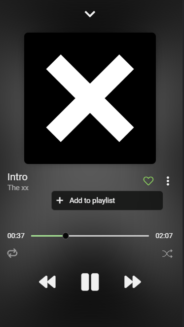
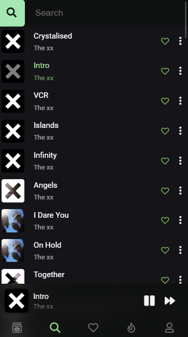

**Zanysound** provides access to your Deezer library and allows you to **listen to music without Deezer premium**

## Instruction

Start [the back-end server](https://github.com/AndryHolovchak/zanysound-backend) and specify back-end URL in .env file (see environment variables section).
 
Run `npm i` and `npm start`
 
Open the browser's dev tools and select mobile view, because the desktop version is not available yet

### Environment variables

REACT_APP_BACKEND_URL - [back-end URL](https://github.com/AndryHolovchak/zanysound-backend)

# Screenshots

